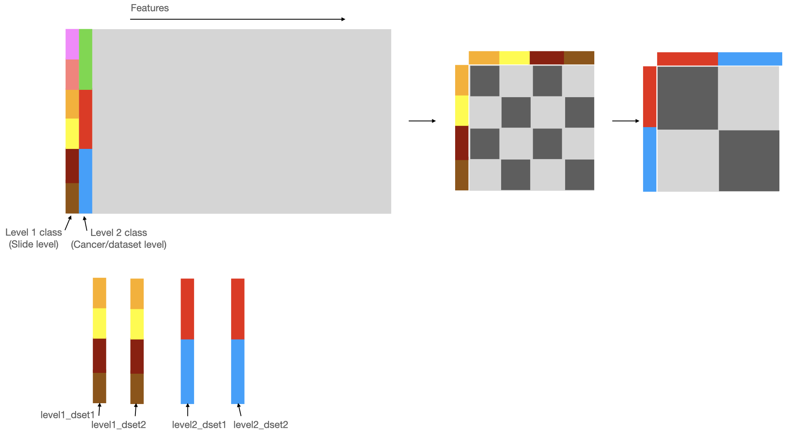

Code for HHOT 


### Environment


To use the environment.yml to create a conda environment: 

```
conda env create -f environment.yml
```

The packages used are:
torch

pot

geomloss

h5py

pandas 

numpy

glob 

argparse

os  


To implement HHOT, first calculate the OT distance
between slides and save to a cost matrix (slide, slide). 
Then using cost matrix (slide, slide) calculate an 
OT distance between datasets (dset, dset). To calculate the 
debiased OT distance, use the function debias(). For a debiased
OT between A and B, you will need to calculate the OT distance 
between A and B, as well as the OT distance between A and A 
and B and B. 

To use the HHOT code with the example provided here, 
run from your HHOT directory:

``` 
python scripts/HHOT.py 
```

The output will be an OT_mat.csv file and an HHOT_mat.csv file. 
The OT_mat.csv file contains the cost matrix (slide, slide)
and the HHOT_mat.csv contains the cost matrix (dset, dset). 




This repo also contains functions to work with hdf5 files. 
Histopathology images are very large and if saved 
as tiles they can easily hit the quota on the number of files 
allowed (if you are constrained by the number of files 
you are allowed to store). 
